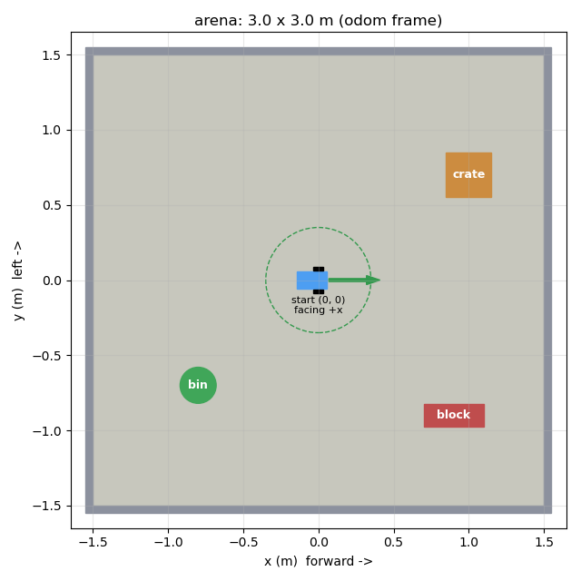

# Build a Yoruba voice-controlled robot with a ROS 2 digital twin

This tutorial rebuilds the whole project from nothing: a flat-chassis two-wheel
robot with a ball caster, driven by an ESP32-S3 over WiFi, controlled by spoken
Yoruba, and mirrored live in RViz and Gazebo. Follow the sections in order.
Every command was run on the reference machine; the expected output follows it.


**What you end up with**

```
 you speak Yoruba ─► laptop mic ─► N-ATLAS speech-to-text ─► "síwájú" = forward
                                                                  │
                     ┌────────────────────────────────────────────┘
                     ▼
              ROS 2 /cmd_vel ─► robot_bridge ─┬─► ESP32-S3 over WiFi ─► L298N ─► motors   (real robot)
                                              ├─► Gazebo physics copy                     (digital twin)
                                              └─► RViz: both robots inside the same arena
```

**Reference setup**: Pop!_OS 24.04 (Ubuntu Noble), NVIDIA RTX 2060, ROS 2 Jazzy,
Gazebo Sim 8, Arduino IDE 2 with the ESP32 core 3.x, conda Python 3.13 for the
speech stack.

## Contents

1. [Parts](#1-parts)
2. [Assemble and wire the robot](#2-assemble-and-wire-the-robot)
3. [Flash the ESP32-S3 firmware](#3-flash-the-esp32-s3-firmware)
4. [Laptop: speech stack (STT + voice pipeline)](#4-laptop-speech-stack)
5. [First drive: voice → robot, no ROS](#5-first-drive-voice--robot-no-ros)
6. [Install ROS 2 Jazzy and Gazebo](#6-install-ros-2-jazzy-and-gazebo)
7. [Create the ROS 2 package](#7-create-the-ros-2-package)
8. [Model the robot (URDF / xacro)](#8-model-the-robot-urdf--xacro)
9. [Model the environment (arena)](#9-model-the-environment-arena)
10. [The nodes](#10-the-nodes)
11. [Launch files and RViz layouts](#11-launch-files-and-rviz-layouts)
12. [Run it: sim, real, twin, voice](#12-run-it)
13. [Calibrate the twin to your robot](#13-calibrate-the-twin-to-your-robot)
14. [Tests](#14-tests)
15. [Troubleshooting: every error we hit](#15-troubleshooting)
16. [Customize](#16-customize)

---

## 1. Parts

| Qty | Part | Notes |
|---|---|---|
| 1 | ESP32-S3 dev board | Freenove ESP32-S3-WROOM (camera board) or ESP32-S3-DevKitC-1 |
| 1 | L298N dual H-bridge module | red PCB with black heatsink |
| 2 | TT gear motor (yellow, 3-6 V) | with 65 mm wheels |
| 1 | Ball caster | about 20 mm ball |
| 1 | Flat chassis plate | acrylic 2WD kit plate, about 200 x 120 mm |
| 1 | 2 x 18650 battery holder + 2 cells | about 7.4 V for the motors |
| - | Jumper wires, M3 standoffs | |
| 1 | USB cable | power and flashing; WiFi does the control |
| 1 | Laptop with a microphone | Linux; this guide uses Ubuntu 24.04 |

## 2. Assemble and wire the robot

**Mechanical layout** (this is what the URDF reproduces in §8):

- Motors under the plate at the **front**, one on each side, shafts pointing out.
- Wheels on the motor shafts, outside the plate edge.
- Ball caster under the **rear** of the plate.
- On top, rear to front: battery holder, L298N, ESP32-S3 (camera facing forward).

**Wiring**

```
L298N    ESP32-S3        role
IN1  ->  GPIO 4          left  motor direction
IN2  ->  GPIO 5          left  motor direction
ENA  ->  GPIO 41         left  motor speed (PWM)
IN3  ->  GPIO 6          right motor direction
IN4  ->  GPIO 7          right motor direction
ENB  ->  GPIO 42         right motor speed (PWM)
GND  ->  GND             common ground (required)
+12V/VS  <- battery +    motor supply (not the ESP32 3V3/5V pin)
OUT1/OUT2 -> left motor  OUT3/OUT4 -> right motor
```

> **Pull the two jumper caps off ENA and ENB** on the L298N before wiring them.
> With the caps on, the enables are tied high: the motors always run at full
> speed and speed commands do nothing.

Why these pins: on an ESP32-S3 camera board, GPIO 41/42 are free. They avoid
the strapping pins (0/3/45/46), USB (19/20), UART0 (43/44), octal PSRAM (35-37),
the camera bus and the onboard LEDs (2/21/47). The L298N reads 3.3 V logic fine.

**Check the motor direction later**: if "forward" makes a wheel spin backwards,
swap that motor's two wires on OUT1/OUT2 (or OUT3/OUT4). Don't fix it in code.

## 3. Flash the ESP32-S3 firmware

Firmware: [firmware/esp32s3_robot/esp32s3_robot.ino](../firmware/esp32s3_robot/esp32s3_robot.ino)
(math in `motor_math.h`).

What it does:
- Joins your WiFi and serves a TCP line protocol on **port 3333**, mDNS name
  `yoruba-robot.local`. USB serial accepts the same commands.
- Protocol, one line per command:
  `F,speed,ms` forward, `B` back, `L` spin left, `R` spin right, `S` stop,
  `P` ping (replies `PONG`). `speed` is 0-255, `ms` is the auto-stop window.
- Speed is PWM on ENA/ENB at 1 kHz (right for an L298N). Speeds 1-255 map onto
  `MIN_DUTY`..255 so slow commands still turn the wheels. Starts and reversals
  ramp over 150 ms (a hard reversal can brown out the ESP32). Stops are instant.
- Safety: motors stop when the WiFi client disconnects, when WiFi drops, and when
  no command arrives for 2 s.

**Steps**

1. Install Arduino IDE 2, then in *Boards Manager* install **esp32 by Espressif** (3.x).
2. Set the WiFi credentials (this file is git-ignored):
   ```bash
   cp firmware/esp32s3_robot/secrets.h.example firmware/esp32s3_robot/secrets.h
   # edit WIFI_SSID / WIFI_PASSWORD. The ESP32 only joins 2.4 GHz networks.
   ```
3. Open `firmware/esp32s3_robot/esp32s3_robot.ino`. Tools menu:
   - Board: **ESP32S3 Dev Module**
   - USB CDC On Boot: **Enabled** if the cable is in the S3's native USB port,
     **Disabled** if it is in the UART port (CH340/CP210x). If Serial Monitor
     stays silent, this setting is the mismatch.
4. Upload, then open Serial Monitor at **115200** and press RST. Expected:
   ```
   WiFi: joining "YourNetwork"...
   READY
   WiFi CONNECTED  ip=192.168.1.197  tcp=3333  host=yoruba-robot.local  rssi=-48
   ```
5. Test from the laptop (on the same WiFi):
   ```bash
   printf 'P\n' | nc -q1 192.168.1.197 3333      # -> READY / PONG
   printf 'F,180,800\n' | nc -q1 192.168.1.197 3333   # wheels turn forward for 0.8 s
   ```

## 4. Laptop: speech stack

The speech side runs in **conda Python 3.13**; ROS 2 later uses the **system
Python 3.12**. They stay separate and talk over a local TCP socket (§10). Don't
try to install `faster-whisper` into the ROS Python, or `rclpy` into conda.

```bash
sudo apt-get install -y portaudio19-dev
/home/okhub/anaconda3/bin/pip install numpy scipy sounddevice torch faster-whisper \
    ctranslate2 transformers huggingface_hub pyserial
```

**Speech-to-text model: N-ATLAS Yoruba ASR** (`NCAIR1/Yoruba-ASR`, a Whisper-small
fine-tune). If it is already in your Hugging Face cache, convert it once,
offline, to the fast CTranslate2 format (about 5 minutes, nothing downloads):

```bash
cd ~/Documents/PROJECTS/STT
/home/okhub/anaconda3/bin/python -m services.stt.model --convert
/home/okhub/anaconda3/bin/python -m services.stt.model        # -> STT model: natlas
```

Optional cloud keys (spoken replies via YarnGPT, phrasing fallback via Grok) go in
`.env` at the repo root (git-ignored):

```ini
XAI_API_KEY=...
YARN_API_KEY=...
```

## 5. First drive: voice → robot, no ROS

Prove the robot and the voice pipeline work before adding ROS.

```bash
/home/okhub/anaconda3/bin/python -m services.robot.controller --health
# port=wifi 192.168.1.197:3333 healthy=True
/home/okhub/anaconda3/bin/python live_caption.py --cpu --robot --speak
```

Say **síwájú** (forward), **sẹ́yìn** (back), **òsì** (left), **ọ̀tún** (right),
**dúró** (stop). Add **kíákíá** for fast or **díẹ̀díẹ̀** for slow. A direction
keeps going until you say dúró.

## 6. Install ROS 2 Jazzy and Gazebo

Skip any step you already have.

```bash
sudo apt install -y software-properties-common curl
sudo add-apt-repository universe
sudo curl -sSL https://raw.githubusercontent.com/ros/rosdistro/master/ros.key \
     -o /usr/share/keyrings/ros-archive-keyring.gpg
echo "deb [arch=$(dpkg --print-architecture) signed-by=/usr/share/keyrings/ros-archive-keyring.gpg] \
http://packages.ros.org/ros2/ubuntu noble main" | sudo tee /etc/apt/sources.list.d/ros2.list
sudo apt update
sudo apt install -y ros-jazzy-desktop ros-jazzy-ros-gz ros-jazzy-xacro \
     ros-jazzy-robot-state-publisher ros-jazzy-teleop-twist-keyboard \
     python3-colcon-common-extensions python3-pytest
```

Check:

```bash
source /opt/ros/jazzy/setup.bash
ros2 pkg list | grep -E "^(ros_gz_sim|ros_gz_bridge|rviz2|xacro)$"
gz sim --version          # Gazebo Sim, version 8.x
```

Make every new terminal ROS-ready (optional but saves typing):

```bash
echo 'source /opt/ros/jazzy/setup.bash' >> ~/.bashrc
echo '[ -f ~/ros2_ws/install/setup.bash ] && source ~/ros2_ws/install/setup.bash' >> ~/.bashrc
```

## 7. Create the ROS 2 package

The package lives **inside the project repo** (`services/ros2/yoruba_robot/`) so
it is version-controlled with everything else. It is **symlinked** into the ROS
workspace so `colcon` can build it.

```bash
mkdir -p ~/ros2_ws/src
ln -sfn ~/Documents/PROJECTS/STT/services/ros2/yoruba_robot ~/ros2_ws/src/yoruba_robot
cd ~/ros2_ws
colcon build --symlink-install --packages-select yoruba_robot
source install/setup.bash
ros2 pkg executables yoruba_robot
# yoruba_robot environment_publisher
# yoruba_robot robot_bridge
# yoruba_robot voice_relay
```

`--symlink-install` links the installed files back to the source, so editing a
`.py`, `.xacro` or `.rviz` file needs no rebuild (only new files or `setup.py`
changes do).

**Package layout**

```
yoruba_robot/
  package.xml, setup.py, setup.cfg, resource/yoruba_robot   # ament_python boilerplate
  description/robot.urdf.xacro      # §8 the robot
  worlds/arena.sdf                  # §9 generated Gazebo world
  config/{sim,real,twin}.rviz       # §11 generated RViz layouts
  launch/{sim,real,twin}.launch.py  # §11
  yoruba_robot/                     # Python nodes and modules
    kinematics.py  arena.py  robot_bridge.py  voice_relay.py
    environment_publisher.py  launch_common.py
  tools/  render_urdf.py  render_arena.py  make_rviz.py
  test/   (gate tests, §14)
```

Two `setup.py` details that matter:

```python
data_files=[ ...,
    share("launch"), share("description"), share("worlds"), share("config") ],  # installs the assets
entry_points={"console_scripts": [
    "robot_bridge = yoruba_robot.robot_bridge:main",
    "voice_relay = yoruba_robot.voice_relay:main",
    "environment_publisher = yoruba_robot.environment_publisher:main"]},
```

## 8. Model the robot (URDF / xacro)

File: [description/robot.urdf.xacro](../services/ros2/yoruba_robot/description/robot.urdf.xacro)

### 8.1 Measure your robot

Measure with a ruler or calipers. These values go at the top of the xacro, and
the two marked ★ also go in `RobotSpec` (`yoruba_robot/kinematics.py`). A test
fails if the two disagree.

| Property | Ours | How to measure |
|---|---|---|
| ★ `wheel_radius` | 0.0325 | wheel diameter / 2 (65 mm TT wheel) |
| ★ `wheel_separation` | 0.150 | centre of left tyre to centre of right tyre |
| `wheel_width` | 0.026 | tyre width |
| `plate_length` x `plate_width` x `plate_thickness` | 0.200 x 0.120 x 0.004 | the chassis plate |
| `plate_x` | -0.045 | plate centre relative to the axle (negative = behind) |
| `plate_bottom_z` | 0.0125 | plate underside height above the axle |
| `caster_radius` | 0.010 | ball radius |
| `caster_x` | -0.120 | caster position relative to the axle (negative = rear) |

### 8.2 Frames

ROS uses REP-103: **+x forward, +y left, +z up**. The robot has:

- `base_footprint`: on the ground under the axle centre. **This is the frame
  `odom` attaches to.**
- `base_link`: the axle centre, `wheel_radius` above `base_footprint`.
- Everything else hangs off `base_link` with fixed joints, except the wheels.

> Rule: a frame can have only one parent. `robot_state_publisher` already
> publishes `base_footprint → base_link`. If the bridge also published
> `odom → base_link`, `base_link` would have two parents and RViz would mark
> the whole model red. So the bridge publishes `odom → base_footprint`.

### 8.3 The xacro, piece by piece

**Arguments and properties.** `prefix` lets one file describe both robots in
the twin (`""` = real robot, `"sim_"` = Gazebo copy). It prefixes link names
only, not joint names, because Gazebo reports wheel angles under the
unprefixed joint names.

```xml
<xacro:arg name="prefix"  default=""/>
<xacro:arg name="use_sim" default="false"/>
<xacro:property name="p" value="$(arg prefix)"/>
<xacro:property name="wheel_radius" value="0.0325"/>
```

**Materials: define once, reference by name.** RViz 2 drops or mis-colours
materials redefined inside each link.

```xml
<material name="tt_yellow"><color rgba="0.98 0.80 0.10 1.0"/></material>
...
<visual> ... <material name="tt_yellow"/> </visual>
```

**Inertia macros.** Every part that becomes a physics body needs `<inertial>`,
or Gazebo drops it. Box: `ixx = m(y²+z²)/12` and so on; a wheel is a cylinder
about +y: `iyy = m r²/2`.

**A fixed part, as a macro**: a joint from `base_link` plus the link.

```xml
<xacro:macro name="fixed_part" params="name x y z">
  <joint name="${name}_joint" type="fixed">
    <parent link="${p}base_link"/> <child link="${p}${name}"/>
    <origin xyz="${x} ${y} ${z}"/>
  </joint>
</xacro:macro>
```

**The flat plate** sits on the motors: bottom at `plate_bottom_z` above the
axle, centre at `plate_x`. A thin red strip on its front edge shows the heading
at a glance.

**Wheels**: continuous joints with axis `0 1 0` (positive angle = rolling
forward). A URDF cylinder's axis is its own z, so the visual is rolled by π/2
about x to stand the wheel up:

```xml
<joint name="${side}_wheel_joint" type="continuous">
  <parent link="${p}base_link"/> <child link="${p}${side}_wheel"/>
  <origin xyz="0 ${y_sign*wheel_separation/2} 0"/> <axis xyz="0 1 0"/>
</joint>
<visual><origin rpy="${PI_2} 0 0"/>
  <geometry><cylinder radius="${wheel_radius}" length="${wheel_width}"/></geometry>
```

Each wheel has a black tyre, a yellow rim and two grey spokes on the outer face.
Without the spokes, a spinning cylinder looks static in RViz.

**The caster**: fixed joint at `caster_x`, ball centre at
`z = -wheel_radius + caster_radius` from the axle, so the ball's bottom touches
the ground exactly like the wheels. All three contacts sit at z = 0; a test
checks this.

**Parts on top**: battery holder with two cells, L298N (red PCB, heatsink, brass
standoffs) and the ESP32-S3 (black PCB, silver module, camera lens facing +x).

**Gazebo-only block** (`use_sim:=true`): wheel friction 1.0, caster friction
0.0 (otherwise the ball drags and the robot can't spin in place), plus two
plugins:

```xml
<plugin filename="gz-sim-diff-drive-system" name="gz::sim::systems::DiffDrive">
  <left_joint>left_wheel_joint</left_joint> <right_joint>right_wheel_joint</right_joint>
  <wheel_separation>0.15</wheel_separation> <wheel_radius>0.0325</wheel_radius>
  <max_linear_acceleration>2.3</max_linear_acceleration>   <!-- = firmware 150 ms ramp -->
  <topic>/cmd_vel_applied</topic>          <!-- shaped command, see §10 -->
  <odom_topic>/sim_odom</odom_topic>
  <frame_id>odom</frame_id> <child_frame_id>sim_base_footprint</child_frame_id>
  <tf_topic>/sim_tf</tf_topic>
</plugin>
<plugin filename="gz-sim-joint-state-publisher-system" name="gz::sim::systems::JointStatePublisher"/>
```

### 8.4 Check the model

```bash
cd ~/Documents/PROJECTS/STT/services/ros2/yoruba_robot
xacro description/robot.urdf.xacro > /tmp/robot.urdf && check_urdf /tmp/robot.urdf
# root Link: base_footprint has 1 child(ren)
#     child(1):  base_link
#         child(1):  battery ... caster_wheel, chassis_plate, controller, left_motor,
#                    left_wheel, motor_driver, right_motor, right_wheel
xacro description/robot.urdf.xacro use_sim:=true > /tmp/gz.urdf && gz sdf -p /tmp/gz.urdf > /dev/null && echo "gazebo ok"
/home/okhub/anaconda3/bin/python tools/render_urdf.py /tmp/robot.urdf /tmp/robot.png   # the image at the top
```

## 9. Model the environment (arena)



File: [yoruba_robot/arena.py](../services/ros2/yoruba_robot/yoruba_robot/arena.py).
The environment is defined **once**, as data:

```python
ARENA = {
    "size_x": 3.0, "size_y": 3.0, "wall_height": 0.25, "wall_thickness": 0.05,
    "start_clear_radius": 0.35,
    "obstacles": [
        {"name": "crate", "shape": "box", "xy": (1.0, 0.7), "size": (0.30, 0.30, 0.20), ...},
        {"name": "bin", "shape": "cylinder", "xy": (-0.8, -0.7), "size": (0.12, 0.25), ...},
        {"name": "block", "shape": "box", "xy": (0.9, -0.9), "size": (0.40, 0.15, 0.12), ...},
    ], ...}
```

From that one definition:
- `to_sdf()` writes the Gazebo world (`worlds/arena.sdf`): floor, four walls,
  obstacles, sun.
- `environment_publisher` draws the same thing in RViz as markers, plus labels
  and a green start pad with an arrow.
- `validate()` rejects obstacles that cross a wall or sit within 0.35 m of the
  start pose.

To change the environment (for example to match your real room):

```bash
# 1. edit ARENA in yoruba_robot/arena.py
cd ~/Documents/PROJECTS/STT/services/ros2/yoruba_robot
python3 -m yoruba_robot.arena > worlds/arena.sdf     # 2. regenerate (refuses an invalid arena)
gz sdf -k worlds/arena.sdf                          # 3. "Valid."
# 4. relaunch. Tests fail if you forget step 2.
```

The world has **no rendering sensors** on purpose: no cameras, so the Gazebo
server never starts a renderer. That avoids the NVIDIA/Ogre crash in §15.

## 10. The nodes

### robot_bridge: the command shaper

[yoruba_robot/robot_bridge.py](../services/ros2/yoruba_robot/yoruba_robot/robot_bridge.py)

1. Subscribes to `/cmd_vel`. `twist_to_command()` snaps the Twist to what the
   firmware can do: whichever of forward/back or spin dominates, with speed
   mapped onto 90-255 duty.
2. Sends that to the ESP32 over WiFi (reusing `services/robot/link.py`,
   including discovery and reconnects) and resends it every 0.4 s so the
   firmware's move window never lapses.
3. Stops when `/cmd_vel` is silent for 0.5 s.
4. Integrates the commanded wheel speeds into **dead-reckoning odometry**:
   `/odom` and the `odom → base_footprint` TF. The arc formula keeps a spin in
   place from drifting.
5. Integrates the **wheel angles** into `/joint_states`, so
   `robot_state_publisher` can place the wheels and they visibly turn.
6. Publishes **`/cmd_vel_applied`**: the command the robot is actually
   executing. **Gazebo drives from this, not from raw `/cmd_vel`.**

Why step 6 matters: the first version fed Gazebo raw `/cmd_vel`. Gazebo then
blended forward and turn motions the real robot can't do, and kept running the
last command forever. After a short test the real robot had gone 0.367 m and
the sim 0.458 m, with different headings. Feeding Gazebo the shaped command
gave 0.500 vs 0.495 m and 2.801 vs 2.750 rad.

### voice_relay: the bridge between the two Pythons

`live_caption.py --ros` (conda Python, speech) writes lines like `F,200` to
`127.0.0.1:7447`. `voice_relay` (ROS Python) turns each line into a Twist on
`/cmd_vel`. It uses the same five-letter protocol as the firmware, so there is
one contract across every border.

### environment_publisher

Publishes the arena as a `MarkerArray` on `/environment` with
**transient-local** QoS (latched), so RViz gets it whenever it starts.

### The TF tree (twin mode)

```
odom ─┬─ base_footprint ─ base_link ─ plate, motors, wheels, caster, battery, L298N, ESP32
      │   ▲ robot_bridge                ▲ robot_state_publisher (+ /joint_states from robot_bridge)
      └─ sim_base_footprint ─ sim_base_link ─ sim_ copies of every part
          ▲ Gazebo DiffDrive (/sim_tf bridged into /tf)
                                         ▲ /sim robot_state_publisher (+ /sim/joint_states from Gazebo)
```

## 11. Launch files and RViz layouts

[yoruba_robot/launch_common.py](../services/ros2/yoruba_robot/yoruba_robot/launch_common.py)
builds every piece once; the three launch files only choose which pieces run:

| Piece | sim | real | twin |
|---|---|---|---|
| Gazebo server + spawn + bridge | ✓ | | ✓ |
| `/sim` robot_state_publisher (sim_ links) | ✓ | | ✓ |
| robot_state_publisher (real links) | | ✓ | ✓ |
| robot_bridge | ✓ (`drive_real:=false`) | ✓ | ✓ |
| environment_publisher, voice_relay, RViz | ✓ | ✓ | ✓ |
| Clock | Gazebo | wall | Gazebo (all nodes) |

Key details:

- **URDF as a parameter**: `ParameterValue(Command(["xacro ", path]), value_type=str)`.
  Without `value_type=str`, Jazzy tries to parse the XML as YAML and the launch
  dies.
- **`QT_QPA_PLATFORM=xcb`** is set by the launch. On a Wayland desktop Qt
  otherwise gives Ogre a Wayland window that its GLX backend can't draw into.
- **Gazebo server only** (`-s`) by default; `gui:=true` adds the Gazebo window.
- **One-way bridges**: `]` = ROS→Gazebo (`/cmd_vel_applied`), `[` = Gazebo→ROS
  (`/sim_odom`, `/sim_tf`→`/tf`, `/clock`, joint states→`/sim/joint_states`).
- **One clock in twin mode**: every node uses Gazebo's `/clock`, so real and sim
  timestamps never conflict in the TF tree.

**RViz layouts** (`config/*.rviz`) are generated by `tools/make_rviz.py` from
one template:

| Display | What you see |
|---|---|
| Grid (10 cm) | scale reference; the robot is 20 cm long |
| Environment (arena) | floor, walls, obstacles, labels, start pad |
| Real robot | solid model at the dead-reckoned pose |
| Gazebo twin | the same model at 45% opacity, at the physics pose |
| Real path / Gazebo path | green / orange arrow trails |
| TF frames | off by default; tick it to see every frame |

The camera follows `base_footprint` (`sim_base_footprint` in sim mode) from
1.1 m. Fixed frame is `odom`. Regenerate after editing the template:
`python3 tools/make_rviz.py`.

## 12. Run it

Each terminal starts with the two `source` lines from §6 (automatic if you
added them to `~/.bashrc`).

### A. Simulation only (the real robot is never touched)

```bash
ros2 launch yoruba_robot sim.launch.py
# second terminal:
ros2 run teleop_twist_keyboard teleop_twist_keyboard     # i forward, j/l turn, k stop
```

### B. Real robot only

```bash
ros2 launch yoruba_robot real.launch.py
# rehearse first without moving it:
ros2 launch yoruba_robot real.launch.py drive_real:=false
```

### C. The digital twin, by voice

```bash
# terminal 1: Gazebo + robot_bridge + voice_relay + RViz
ros2 launch yoruba_robot twin.launch.py
# terminal 2: your voice
cd ~/Documents/PROJECTS/STT
/home/okhub/anaconda3/bin/python live_caption.py --cpu --ros --speak
```

Say **síwájú**: the robot on the floor and both models in RViz drive forward
together. **òsì** spins left, **dúró** stops. Watch the solid (real) and the
see-through (Gazebo) robots: if they separate, see §13.

Expected launch log lines:

```
[ros_gz_sim]: Entity creation successful.
[environment_publisher]: environment: 3.0x3.0 m arena, 3 obstacles, 13 markers
[robot_bridge]: robot link: wifi 192.168.1.197:3333
[voice_relay]: voice_relay listening on 127.0.0.1:7447
```

### Verify from the command line

```bash
ros2 run tf2_ros tf2_echo odom base_footprint --ros-args -p use_sim_time:=true
ros2 run tf2_ros tf2_echo odom sim_base_footprint --ros-args -p use_sim_time:=true
ros2 topic echo /joint_states --once
ros2 topic echo /environment --once --qos-durability transient_local | grep -c "ns:"   # 13
```

## 13. Calibrate the twin to your robot

The real robot's position in RViz is dead reckoning: it assumes the wheels turn
exactly as commanded. Make that assumption match your motors:

1. **Top speed**: on the floor, send a 3-second full-speed move and measure
   the distance:
   ```bash
   printf 'F,255,3000\n' | nc -q1 192.168.1.197 3333
   ```
   `max_linear = distance_m / 3`.
2. **Spin rate**: `printf 'L,255,3000\n' | nc -q1 192.168.1.197 3333`, then count
   the turns. `max_angular = turns * 2π / 3`.
3. Put both in `RobotSpec` in `yoruba_robot/kinematics.py`, which is the single
   source of truth for both nodes.
4. Robot curves when driving straight: lower `LEFT_TRIM` or `RIGHT_TRIM` for
   the faster wheel in the firmware (for example 92) and re-flash.
5. Slow commands only hum: raise `MIN_DUTY` in the firmware, and set the same
   number in `RobotSpec.min_duty`.

## 14. Tests

Gate tests are free, deterministic and finish in seconds:

```bash
cd ~/Documents/PROJECTS/STT
python3 -m unittest services.ros2.yoruba_robot.test.test_kinematics \
                    services.ros2.yoruba_robot.test.test_environment \
                    services.ros2.yoruba_robot.test.test_description
cd services/ros2/yoruba_robot && python3 -m pytest test/test_markers.py test/test_voice_relay.py
```

| Test | Guards |
|---|---|
| `test_kinematics` | Twist↔command mapping, REP-103 turn sign, odometry (straight, arc, spin without drift), wheel angles |
| `test_description` | the parts list, wheel size/spacing = `RobotSpec`, all three contacts at z = 0, wheels clear the plate, global materials, inertias, sim prefix, Gazebo plugin wiring |
| `test_environment` | arena validity, `arena.sdf` and `*.rviz` identical to their generators |
| `test_markers` | one marker per part, unique ids, obstacles on the floor |
| `test_voice_relay` | the `F,200` line parser |

## 15. Troubleshooting

Every one of these happened while building this project.

| Symptom | Cause | Fix |
|---|---|---|
| `Package 'yoruba_robot' not found` | workspace not sourced in this terminal | `source ~/ros2_ws/install/setup.bash` |
| `Unable to parse the value of parameter robot_description as yaml` | Jazzy YAML-parses string parameters | wrap in `ParameterValue(..., value_type=str)` |
| `ModuleNotFoundError: No module named 'services'` from a node | installed node can't see the repo | `robot_bridge` resolves the symlink back to the repo root (`os.path.realpath(__file__)`) |
| `KeyError: 'F'` in robot_bridge | wire letters vs action names mixed up | kinematics uses `forward/backward/...`; letters only at the wire |
| RViz: `Invalid parentWindowHandle (wrong server or screen)` then abort | Wayland session; Qt hands Ogre a Wayland window | `QT_QPA_PLATFORM=xcb` (set in the launch) |
| Gazebo window segfaults in `Ogre::Hlms::createDatablock` | Ogre renderer vs NVIDIA driver / Wayland | run the Gazebo **server only** (default); RViz shows everything. Try `gui:=true` later |
| RobotModel red: "No transform from base_link" | `base_link` had two TF parents | bridge publishes `odom → base_footprint` |
| RobotModel red: no transform for the wheels | nobody published `/joint_states` | robot_bridge now publishes wheel angles |
| Model colours wrong or missing | materials redefined per link | define materials once at robot scope |
| Robot drawn as a speck | 2.5 m camera, 0.5 m grid for a 20 cm robot | 1.1 m follow camera, 10 cm grid |
| Real and Gazebo robots disagree | Gazebo ran raw `/cmd_vel` with no timeout | Gazebo runs `/cmd_vel_applied` |
| Model flickers or jumps | two copies of a launch running | `pgrep -af "ros2 launch"`, stop the extras |
| `voice_relay` won't start: address in use | another voice_relay on port 7447 | the launch starts one; don't also `ros2 run` it |
| `no robot answered on ... port 3333` | laptop not on the robot's WiFi | join the same network, or set `ROBOT_HOST=<ip>` in `.env` |
| `ros2 topic list` misses topics | CLI daemon is stale | `ros2 daemon stop`, or add `--no-daemon` |

## 16. Customize

- **Caster at the front**: set `caster_x` positive (e.g. `0.080`) and move
  `plate_x` forward to match.
- **Different wheels**: change `wheel_radius` / `wheel_separation` in the xacro
  **and** in `RobotSpec`. The description test catches a mismatch.
- **Your room as the arena**: measure it, edit `ARENA`, regenerate the world (§9).
- **More parts on the plate**: copy the `controller` block (a `fixed_part` and
  its link with visuals and an inertial).
- **Look at it**: `python3 tools/render_urdf.py /tmp/robot.urdf out.png` draws
  four views without ROS or a GPU.
