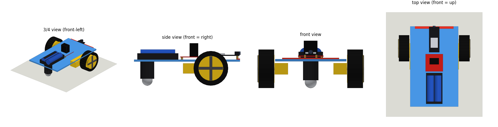

# services/ros2 — `yoruba_robot` digital twin

The ROS 2 Jazzy package that puts the Yoruba voice robot in RViz and Gazebo.
One `/cmd_vel` drives the real ESP32 robot over WiFi; Gazebo runs an identical
copy on exactly the command the real robot executes; RViz draws both robots
inside the same arena.

Step-by-step build guide (hardware to digital twin): **[docs/TUTORIAL.md](../../docs/TUTORIAL.md)**.



## Data flow

```
live_caption.py --ros ──TCP :7447──► voice_relay ──► /cmd_vel ◄── teleop_twist_keyboard
                                                        │
                                                   robot_bridge
                       ┌────────────────────────────────┼─────────────────────────────┐
                       ▼                                ▼                             ▼
               ESP32 over WiFi                 /odom, /tf (odom→base_footprint)  /cmd_vel_applied
               (F/B/L/R/S lines)               /joint_states (wheel angles)          │
                                                        │                            ▼
                                               robot_state_publisher           Gazebo DiffDrive
                                               (/robot_description)            /sim_odom, /sim_tf→/tf
                                                        │                      /sim/joint_states
                                                        ▼                            │
                                               RViz: solid "Real robot"       sim robot_state_publisher
                                                                              (/sim/robot_description)
                                                                                     ▼
                                                                         RViz: see-through "Gazebo twin"
```

`robot_bridge` is the single place where a Twist becomes a robot command: it
snaps to the firmware's forward/back/spin moves and duty steps, and stops after
0.5 s without commands. Gazebo is fed that shaped command (`/cmd_vel_applied`),
so the sim reproduces the real robot's behaviour. Verified: 3 s forward = 0.500 m
real (dead reckoning) vs 0.495 m sim; a spin = 2.801 vs 2.750 rad.

## TF tree

```
odom ─┬─ base_footprint ── base_link ─┬─ chassis_plate, left/right_motor, caster_wheel
      │  (robot_bridge)                ├─ battery, motor_driver, controller
      │                                └─ left_wheel, right_wheel   (from /joint_states)
      └─ sim_base_footprint ── sim_base_link ── sim_* (same parts)
         (Gazebo DiffDrive)                    (from /sim/joint_states)
```

## Files

| Path | What it is |
|---|---|
| `description/robot.urdf.xacro` | The robot: flat acrylic plate, 2 TT motors + 65 mm wheels, rear ball caster, battery, L298N, ESP32-S3. Args `prefix` (link-name prefix) and `use_sim` (Gazebo plugins). |
| `yoruba_robot/arena.py` | The environment, defined once: 3 x 3 m walled floor + 3 obstacles. Generates the Gazebo world and the RViz markers. |
| `worlds/arena.sdf` | Generated from `arena.py` (`python3 -m yoruba_robot.arena > worlds/arena.sdf`). A test fails if it drifts. |
| `yoruba_robot/robot_bridge.py` | `/cmd_vel` → ESP32 + `/odom`, TF, `/joint_states`, `/cmd_vel_applied`. |
| `yoruba_robot/voice_relay.py` | TCP :7447 line protocol (`F,200`) → `/cmd_vel`. Bridges conda Python (STT) to ROS Python. |
| `yoruba_robot/environment_publisher.py` | `arena.py` → `/environment` MarkerArray (latched). |
| `yoruba_robot/kinematics.py` | Pure math: Twist↔F/B/L/R, odometry, wheel angles. `RobotSpec` holds the calibrated robot constants. |
| `yoruba_robot/launch_common.py` | Shared launch building blocks. |
| `launch/{sim,real,twin}.launch.py` | The three modes. |
| `config/{sim,real,twin}.rviz` | RViz layouts, generated by `tools/make_rviz.py`. |
| `tools/render_urdf.py`, `tools/render_arena.py` | Draw the robot / arena to PNG without ROS or a GPU. |

## Run

Every terminal: `source /opt/ros/jazzy/setup.bash && source ~/ros2_ws/install/setup.bash`

| Command | What starts |
|---|---|
| `ros2 launch yoruba_robot sim.launch.py` | Gazebo twin only. Real robot untouched. |
| `ros2 launch yoruba_robot real.launch.py` | Real robot only (no Gazebo). |
| `ros2 launch yoruba_robot twin.launch.py` | Both, side by side. |

Arguments: `gui:=true` (also open the Gazebo window), `voice:=false` (don't
start voice_relay), `drive_real:=false` (never open the ESP32 link; the
default for `sim`).

Then drive with your voice (`/home/okhub/anaconda3/bin/python live_caption.py --cpu --ros --speak`)
or the keyboard (`ros2 run teleop_twist_keyboard teleop_twist_keyboard`).

## Topics

| Topic | Type | Publisher |
|---|---|---|
| `/cmd_vel` | Twist | voice_relay, teleop |
| `/cmd_vel_applied` | Twist | robot_bridge (what the robot executes; drives Gazebo) |
| `/odom` | Odometry | robot_bridge (dead reckoning) |
| `/joint_states` | JointState | robot_bridge |
| `/robot_description` | String (latched) | robot_state_publisher |
| `/sim_odom` | Odometry | Gazebo |
| `/sim/joint_states` | JointState | Gazebo |
| `/sim/robot_description` | String (latched) | sim robot_state_publisher |
| `/environment` | MarkerArray (latched) | environment_publisher |
| `/tf`, `/tf_static`, `/clock` | | robot_bridge, RSPs, Gazebo |

## robot_bridge parameters

| Param | Default | Meaning |
|---|---|---|
| `drive_real` | `true` | `false` = never open the ESP32 link |
| `require_robot` | `false` | `true` = exit if the ESP32 can't be reached |
| `cmd_timeout` | `0.5` s | stop when `/cmd_vel` goes quiet |
| `hold_ms` | `1000` | firmware move window per command |
| `publish_rate` | `50` Hz | odom / TF / joint_states rate |
| `wheel_radius`, `wheel_separation` | `0.0325`, `0.15` m | must equal the URDF (gate-tested via `RobotSpec`) |
| `max_linear`, `max_angular` | `0.35` m/s, `3.5` rad/s | measured top speeds (calibrate: tutorial §13) |
| `min_duty` | `90` | firmware `MIN_DUTY` |

## Tests

```bash
# from the repo root, any Python (no ROS needed except test_description, which shells out to xacro)
python3 -m unittest services.ros2.yoruba_robot.test.test_kinematics \
                    services.ros2.yoruba_robot.test.test_environment \
                    services.ros2.yoruba_robot.test.test_description -v
# ROS message tests (system Python, ROS sourced)
cd services/ros2/yoruba_robot && python3 -m pytest test/test_markers.py test/test_voice_relay.py
```

They cover the kinematics, wheel-angle integration, arena validity, world and
RViz files staying in sync with their generators, URDF geometry (three ground
contacts, wheels clear of the plate, sizes equal to `RobotSpec`, materials,
inertias, sim prefix, Gazebo plugin wiring), the markers, and the voice line
parser.
